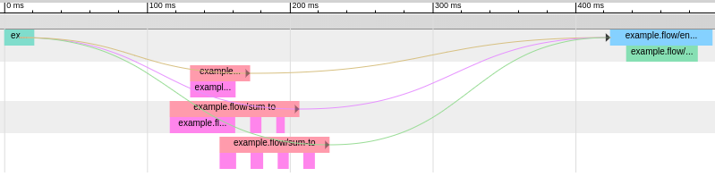

# Needle



A simple Clojure profiler that works as a drop in `defn` replacement. Its output
is to be loaded in [chrome://tracing](chrome://tracing).

* Supports multi-process and multi-thread profiling.
* Minimal performance impact in debug mode, negligible otherwise (see example bellow).
* Cleaning and export of the data done in a separate tread.

## Usage

```clojure
(ns example
  (:require [needle.trace :refer [defn-trace dump-log]]))

(def my-agent
  (when (= (System/getenv "DEBUG") "true")
    (agent [])))

(defn-trace my-function my-agent
  "Document string"
  [max-val somefn setarg]
  (reduce somefn 0 (range max-val)))

(def max-vals
  (map
   #(+ 500000 (rand-int 1000000) %)
   (range 10)))

(doseq [i max-vals]
  (my-function i + {#{:a :b} :c}))

(when (= (System/getenv "DEBUG") "true")
  (send my-agent dump-log "target.json" "Test log" "PERF"))
```

If you run the above code without the `DEBUG` env variable set to `true`,
then `my-agent` will be `nil` and `defn-trace` will behave exactly like `defn`.
If `DEBUG=true`, then profiling data will be sent to `my-agent`, cleaned and
exported to `target.json`.

You can then load `target.json` into [chrome://tracing](chrome://tracing) to
see the associated graph.

`fn-trace` is to `defn-trace` what `fn` is to `defn`, with the difference that
`fn-trace` functions cannot be anonymous and require a name, for tracing
purpose.

## Documentation

Reference document for the [Chrome Tracing Format](https://docs.google.com/document/d/1CvAClvFfyA5R-PhYUmn5OOQtYMH4h6I0nSsKchNAySU/preview#!).

More detailed examples can be found in the `examples` folder.

`defn-trace` and `fn-trace` can alternatively take a map as parameter. The map
can have the following keys, the default value is in brackets.

* `:agent` → the agent itself, **must** be set.
* `:save-args true | [false]` → whether arguments' value should be saved.
* `:args-mask [(true|false|fn)+] [nil]` → detailed lists of arguments to save
  `false` will result in the value of the variable appearing as `__unsaved__`.
* `:save-output true | [false]` → whether to save the output or not
* `:mode :EB [:X]` → which event mode is to be used
* `:flow-mode :s :t :f [nil]` → if `nil`, disabled, otherwise saves an additional
  flow event, `:s` and `:t` at the end of the `:EB` event, `:f` at the beginning.
  See reference doc for explanation.

Example:

```clojure
(defn-trace my-function
  {:agent my-agent
   :save-args true
   :args-mask [true false (fn [arg] (count arg)]
   :save-output true
   :mode :EB}
  "Document string"
  [max-val somefn setarg]
  (reduce somefn 0 (range max-val)))
```

Notice that `:args-mask` can have a processing function for the arg to only save the
argument partially.

## TODO

* [DONE] ~~Support for flow events~~
* Support for async events
* Support for multimethods
* [DONE] ~~None of the macros work on multi arity functions.~~

## License

Copyright © 2020

This program and the accompanying materials are made available under the
terms of the Eclipse Public License 2.0 which is available at
http://www.eclipse.org/legal/epl-2.0.

This Source Code may also be made available under the following Secondary
Licenses when the conditions for such availability set forth in the Eclipse
Public License, v. 2.0 are satisfied: GNU General Public License as published by
the Free Software Foundation, either version 2 of the License, or (at your
option) any later version, with the GNU Classpath Exception which is available
at https://www.gnu.org/software/classpath/license.html.
